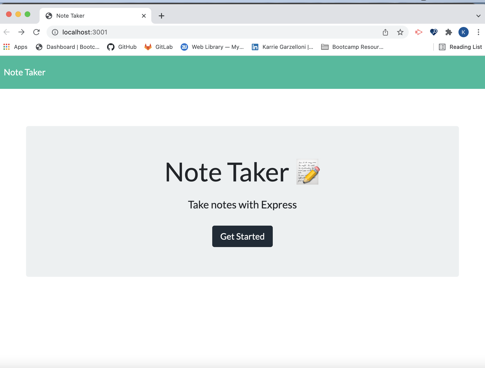

# 11 Express.js: Note Taker

## The Task

The objective of this project was to modify starter code to create an application called Note Taker that can be used to write and save notes. This application will use an Express.js back end and will save and retrieve note data from a JSON file.

## User Story

```
AS A small business owner
I WANT to be able to write and save notes
SO THAT I can organize my thoughts and keep track of tasks I need to complete
```

## Mock-Up

The following images show the web application's appearance:



  
## Contributors:
Karrie Garzelloni
  
## Questions? 
Email: kgarzelloni@yahoo.com
Github: https://github.com/kgarzelloni

## Quick access links to view repository:
https://github.com/kgarzelloni/11-note-taker

